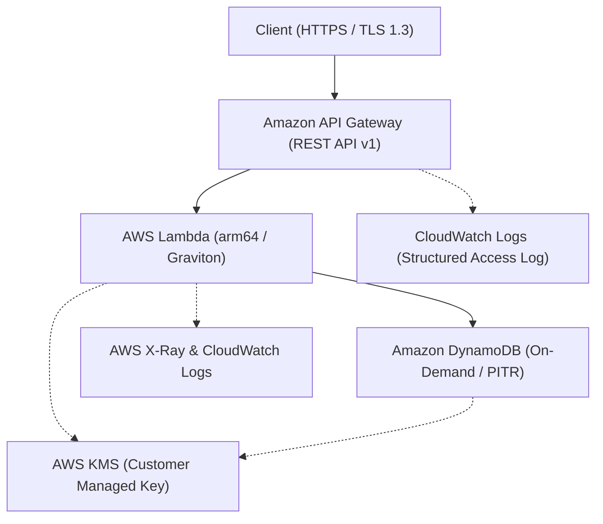

# DualForge-Serverless-AWS ⚡

> **Terraform × AWS CDK 二刀流で紡ぐ、本番レディなサーバーレスREST APIインフラストラクチャ**

低レイテンシー・高可用性・強固なセキュリティを兼ね備えたフルマネージドREST API基盤です。
インフラストラクチャ・アズ・コード（IaC）の2大巨頭である **Terraform（HCL）** と **AWS CDK（TypeScript）** の双方に対応し、同一のアーキテクチャ要件を両アプローチで完全にプロビジョニングできる検証・実践リポジトリとなっています。

---

## 🌟 プロジェクトのハイライト

- **完全サーバーレス & スケーラブル**: API Gateway + AWS Lambda (Graviton2 / arm64) + Amazon DynamoDB (オンデマンドキャパシティ)。
- **エンタープライズグレードの堅牢性**: AWS KMS (CMK) による保存時暗号化、DynamoDB PITR（Point-in-Time Recovery）、TLS 1.3 通信。
- **徹底した可観測性 (Observability)**: AWS X-Ray 分散トレーシング、CloudWatch Logs 構造化JSONアクセスログ、エラーメトリクス監視。
- **二刀流 IaC 設計**: 静的基盤の厳格なステート管理（Terraform）とアプリ結合層の型安全な迅速開発（CDK）の比較・並行運用が可能。

---

## 🏛️ インフラストラクチャ構成図



---

## 📁 ディレクトリ構造

```text
.
├── terraform/                  # Terraform 実装コード (HCL)
│   ├── environments/
│   │   ├── dev/                # 開発環境パラメータ & Backend定義
│   │   └── prod/               # 本番環境パラメータ (削除保護等有効)
│   ├── modules/                # 再利用可能モジュール群
│   │   ├── apigateway/         # API Gateway 定義
│   │   ├── lambda/             # Lambda 関数 & IAMロール定義
│   │   └── dynamodb/           # DynamoDB & KMS定義
│   └── versions.tf             # AWS Provider & Terraform バージョン制約
│
├── cdk/                        # AWS CDK 実装コード (TypeScript)
│   ├── bin/
│   │   └── app.ts              # CDK エントリーポイント
│   ├── lib/
│   │   ├── constructs/         # L2/L3 カスタムコンストラクト
│   │   └── serverless-stack.ts # メインスタック定義
│   ├── cdk.json
│   └── tsconfig.json
│
├── src/                        # アプリケーションロジック
│   ├── handlers/               # Lambda ハンドラーコード
│   └── package.json
└── README.md
```

---

## 🚀 デプロイ手順

### 1. 前提条件
- AWS CLI 設定済み（AdministratorAccess または適切なプロビジョニング権限）
- Node.js 20.x 以上
- Terraform 1.7.0 以上

### 2. Terraform によるデプロイ
```bash
cd terraform/environments/dev

# 初期化 & 検証
terraform init
terraform validate

# 実行計画の確認 & 反映
terraform plan
terraform apply
```

### 3. AWS CDK によるデプロイ
```bash
cd cdk

# 依存パッケージインストール
npm install

# 差分確認 & デプロイ
npx cdk diff
npx cdk deploy --context env=dev
```

---

## 🎬 キャスト & エンドロール

本プロジェクトは、AIアプリ工場劇場のプロフェッショナルたちによる協調オーケストレーションによって生み出されました。

- agent🔵 : **要件定義 & 企画構想** — サーバーレスアーキテクチャの選定と二刀流IaC運用のグランドデザインを策定。
- agent🍇 : **アーキテクチャ設計 & ガバナンス** — KMS暗号化・最小権限IAM・オブザーバビリティ規約のブループリントを設計。
- agent🍊 : **IaC実装 & ビルド** — Terraform HCLおよびAWS CDK TypeScriptコードを電光石火で組み上げ。
- agent🟢 : **品質保証 & テスト検証** — 静的解析・セキュリティ監査・冪等性テストを徹底し、本番運用耐性を証明。
- agent🟡 : **プロデュース & 統合** — 全成果物を調和させ、リポジトリを完成へと導いた総合プロデューサー。